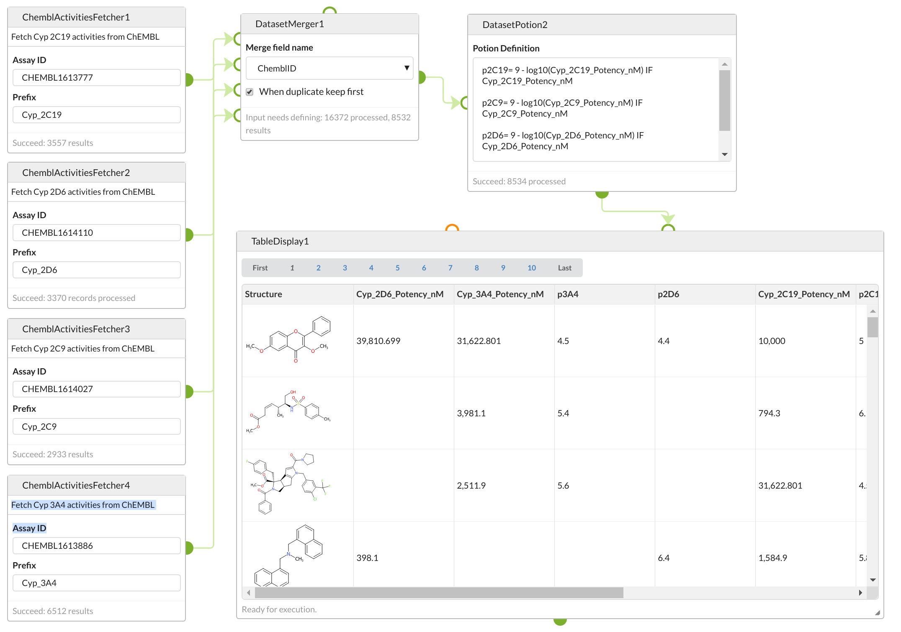

# Cyp P450 dataset creation

Here we describe generating a dataset of cytochrome P450 inhibition data that is created using a [Squonk Computational
Notebook](https://squonk.it/) to merge data from a number of ChEMBL datasets.

Squonk has a cell that uses the ChEMBL REST API to fetch molecular and activity data for a particular ChEMBL assay.
We use that cell to fetch data for four different cytochrome P450 assays, and then to merge those datasets into a single
dataset, and to convert the activities into pIC50 values. The combined data is available in SDF and JSON formats and can
be used for tasks such as generating predictive models.

## ChEMBL REST API

A description of the ChEMBL REST API can be found
[here](https://chembl.gitbook.io/chembl-interface-documentation/web-services/chembl-data-web-services).
The part we are using here is the ability to fetch data for an assay given the assay ID.
As an example here is a request for one of the assays we will be using in this study:

[https://www.ebi.ac.uk/chembl/api/data/activity.json?assay_chembl_id=CHEMBL1613777]()

You will notice a number of things:

1. A set of assay results is returned
1. Each result contains a number of assay values in various forms
1. Each result contains a canonical smiles value and that structure's ChEMBL ID
1. Not all the results for the assay are returned. The next page of data can be fetched using the `page_meta.next` property.

## Squonk notebook

Details of how the Squonk cell handles this to fetch the entire dataset can be found in the 
[cell description](https://squonk.it/docs/cells/ChEMBL%20Activities%20Fetcher/)
and the Javadoc for the [ChemblClient](https://github.com/InformaticsMatters/squonk/blob/63386998ea67db4260e11db1f4566aebd7f93fc8/components/common-utils/src/main/groovy/org/squonk/chembl/ChemblClient.java) 
Java class but to cut a long story short the Squonk cell repeatedly calls the ChEMBL REST API to fetch all the data for the specified
assay, storing the `activities.canonical_smiles` property as the structure of the molecule, the ChEMBL structure identifier
as the `ChemblID` field, and the value of the `activities.standard_value` property stored as a field of the name 
`{prefix}_{activities.standard_type}_{activities.standard_units}`
where `{prefix}` is a user specified value. For instance to fetch data for the 2C19 isoform you would set the cell's `Assay ID` 
parameter to `CHEMBL1613777` and its `Prefix` value to `Cyp_2C19`. This would fetch data that includes a field named
`Cyp_2C19_Potency_nM` that contains the IC50 value.

Here we want to fetch data for four different P450 isoforms:

| Assay ID      | Isoform |
|---------------|---------|
| CHEMBL1613886 | 3A4 |
| CHEMBL1613777 | 2C19 |
| CHEMBL1614110 | 2D6 |
| CHEMBL1614027 | 2C9 |

To do this we need four instances of the cell on the notebook, one for each assay. This gives us four independent datasets, 
but we want to merge them into a single dataset. We can use the `Merge Datasets` cell (see 
[here](https://squonk.it/docs/cells/Merge%20Datasets/) for docs) to do this. We already have the `ChemblID` field that 
contains the ChEMBL ID of each structure so we can use this to identify the common records. The result is a combined dataset
with a record (e.g. row) for each structure and a field (e.g. column) for each of the 4 Cyp IC50s.

All that is left to do is to tidy the data up a bit. To do this we use a `Dataset Potion` cell (see 
[here](https://squonk.it/docs/cells/Dataset%20Potion/) for docs) which can do a range of data cleaning and transformations.
In the simplest case we just want to convert the IC50s to pIC50s so use this potion:

```
p2C19= 9 - log10(Cyp_2C19_Potency_nM) IF Cyp_2C19_Potency_nM
p2C9= 9 - log10(Cyp_2C9_Potency_nM) IF Cyp_2C9_Potency_nM
p2D6= 9 - log10(Cyp_2D6_Potency_nM) IF Cyp_2D6_Potency_nM
p3A4= 9 - log10(Cyp_3A4_Potency_nM) IF Cyp_3A4_Potency_nM
``` 

This creates new fields with the 4 different pIC50 values.

Instead we could also delete records which did not contain values for all four different isoforms (e.g. if we wanted a 
complete dataset) with a potion like this:

```
delete IF !Cyp_2C19_Potency_nM
delete IF !Cyp_2C9_Potency_nM
delete IF !Cyp_2D6_Potency_nM
delete IF !Cyp_3A4_Potency_nM

p2C19= 9 - log10(Cyp_2C19_Potency_nM) IF Cyp_2C19_Potency_nM
p2C9= 9 - log10(Cyp_2C9_Potency_nM) IF Cyp_2C9_Potency_nM
p2D6= 9 - log10(Cyp_2D6_Potency_nM) IF Cyp_2D6_Potency_nM
p3A4= 9 - log10(Cyp_3A4_Potency_nM) IF Cyp_3A4_Potency_nM
``` 

The resulting notebook looks like this:




## Results

Finally we can download the results as SDF or JSON format from the export tab of the expanded view of the DatasetPotion cell.
Here is that data:

- SDF format: [results.sdf]()
- JSON format: [data](results.json), [metadata](results_metadata.json)

## Other ChEMBL assays

This approach should work with other ChEMBL assays, though this will be somewhat dependent on the nature of the data fields 
with each assay.
