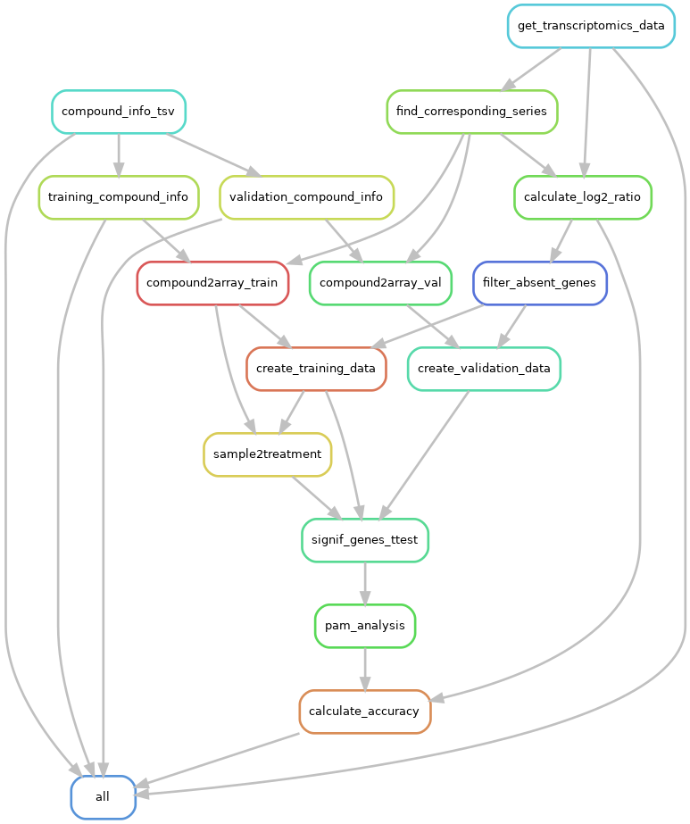

openrisknet_magkoufopoulou
==============================

Reproducibility analysis using the publication: "A transcriptomics-based in vitro assay for predicting chemical genotoxicity in vivo",
by C.Magkoufopoulou et. al. We tried to reproduce the same analysis.

NOTE: Project Organization shown below are obtained from the **cookiecutter** project templates, but many of the generated files were not used. See below for more detailed description.

Project Organization
------------

    ├── LICENSE
    ├── Makefile           <- Makefile with commands like `make data` or `make train`
    ├── README.md          <- The top-level README for developers using this project.
    ├── data
    │   ├── external       <- Data from third party sources.
    │   ├── interim        <- Intermediate data that has been transformed.
    │   ├── processed      <- The final, canonical data sets for modeling.
    │   └── raw            <- The original, immutable data dump.
    │
    ├── docs               <- A default Sphinx project; see sphinx-doc.org for details
    │
    ├── models             <- Trained and serialized models, model predictions, or model summaries
    │
    ├── notebooks          <- Jupyter notebooks. Naming convention is a number (for ordering),
    │                         the creator's initials, and a short `-` delimited description, e.g.
    │                         `1.0-jqp-initial-data-exploration`.
    │
    ├── references         <- Data dictionaries, manuals, and all other explanatory materials.
    │
    ├── reports            <- Generated analysis as HTML, PDF, LaTeX, etc.
    │   └── figures        <- Generated graphics and figures to be used in reporting
    │
    ├── requirements.txt   <- The requirements file for reproducing the analysis environment, e.g.
    │                         generated with `pip freeze > requirements.txt`
    │
    ├── src                <- Source code for use in this project.
    │   ├── __init__.py    <- Makes src a Python module
    │   │
    │   ├── data           <- Scripts to download or generate data
    │   │   └── make_dataset.py
    │   │
    │   ├── features       <- Scripts to turn raw data into features for modeling
    │   │   └── build_features.py
    │   │
    │   ├── models         <- Scripts to train models and then use trained models to make
    │   │   │                 predictions
    │   │   ├── predict_model.py
    │   │   └── train_model.py
    │   │
    │   └── visualization  <- Scripts to create exploratory and results oriented visualizations
    │       └── visualize.py
    │
    └── tox.ini            <- tox file with settings for running tox; see tox.testrun.org

--------

<small>Project based on the <a target="_blank" href="https://drivendata.github.io/cookiecutter-data-science/">cookiecutter data science project template</a>. #cookiecutterdatascience</small>

How to run this pipeline to reproduce the similar results
================

In this folder just type ``snakemake`` and the results should be generated. Final results are *pam_accuracy_training_data.tsv* and *pam_accuracy_validation_data.tsv*, which show accuracy results for both training and validation data. Many other files are also generated, please check the ones that deem to be relevant.

Requirements
-----

Operating system: Ubuntu 16.04.4 LTS

Required ``python`` version and its software packages:
- python==3.6.5
- snakemake==5.0.0
- pandas==0.22.0

Required ``R`` version and its packages:
- R==3.4.3
- pamr==1.55

Required data:
- PMA table file, located at: ./data/interim/PMAtable_217_arrays.tsv
- Supplementary_Data_1.xls file, our pipeline can download the supplementary_data.zip from the publisher's site. However, they can block your IP if you run this script multiple times. So, we provide the only Excel file from that supplementary files.
 

The following command creates a directed acyclic graph (DAG) of jobs (shown below) in the Snakemake file:
`snakemake --dag | dot -Tpng > snakemake_dag.png`

